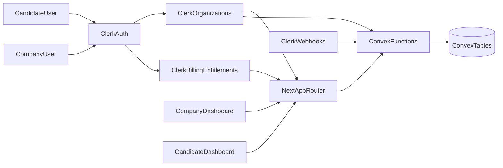

# Indeed Clone Implementation Plan

## Beginner-friendly roadmap

### What this app is (in simple terms)

- Two types of users:
  - **Job seekers (free)**: search jobs, save jobs, apply, track applications.
  - **Companies (paid)**: post jobs, review applicants, decide yes/no, manage team access.
- **Clerk** handles sign-in, organizations, and billing.
- **Convex** stores app data (jobs, applications, profiles, favorites, notifications).
- Candidate entrypoint is `/` (not `/app`).

### Simple rule of ownership

- **Clerk owns**: auth, organizations, billing plans/entitlements.
- **Convex owns**: marketplace data and product workflows.
- **Important**: no billing sync to Convex.

### Build order (recommended for beginners)

1. **Auth + route protection**
  - Make sign-in/sign-up work.
  - Protect app routes.
  - Add company-only route protection.
2. **Core data model**
  - Add tables for users, companies, jobs, applications, favorites, profiles, notifications.
3. **Candidate MVP**
  - Job search + filters.
  - Job detail + apply.
  - Saved jobs.
  - My applications.
4. **Company MVP**
  - Create/edit job listings.
  - View applicants.
  - Mark applications yes/no.
  - Trigger applicant notification when status changes.
5. **Billing and access gates**
  - Add Clerk billing page with `<PricingTable />`.
  - Use Clerk checks (`has()`) to gate paid company features.
6. **Polish**
  - Beautiful landing page.
  - Loading/empty/error states.
  - Basic tests of key flows.

### First release checklist (MVP)

- Candidate can sign up, search jobs, apply, and see application history.
- Candidate can save/favorite jobs.
- Company can create jobs and review applicants.
- Company can accept/reject (yes/no) an applicant.
- Candidate receives in-app notification for status changes.
- Billing only affects company features.

### Terms cheat sheet

- **Tenant**: one company workspace (one Clerk organization).
- **Entitlement**: a paid feature access flag from Clerk billing.
- **Org role**: company member permission level (admin/recruiter/member).
- **Webhook**: event from Clerk used to sync users/orgs/memberships.

### Company roles (extremely clear defaults)

- `**org:admin` (Owner/Admin)**
  - Can manage billing and plan upgrades.
  - Can invite/remove team members.
  - Can assign roles.
  - Can create/edit/close any job listing.
  - Can view all applications and mark decisions (yes/no).
- `**org:recruiter` (Hiring team)**
  - Can create/edit job listings.
  - Can view and review applications.
  - Can mark application decisions (yes/no/reject/advance).
  - Cannot manage billing.
  - Cannot change org roles.
- `**org:member` (Viewer/Coordinator)**
  - Can view dashboards and application lists (read-only by default).
  - Cannot publish/edit jobs (unless explicitly enabled later).
  - Cannot mark decisions.
  - Cannot manage billing or members.

### Company billing tiers (extremely clear defaults)

- **Free (trial/start)**
  - Seats: **1**
  - Active job listings: **1**
  - Application review: basic list only
  - Included: company profile, posting one job
- **Starter**
  - Seats: **3**
  - Active job listings: **5**
  - Included: full applicant review + yes/no decisions
  - Included: email or in-app status notifications
- **Growth**
  - Seats: **10**
  - Active job listings: **25**
  - Included: advanced filters + priority placement options
  - Included: stronger reporting on applicants/jobs

### Canonical plan matrix (use this exact mapping)

| Item                         | `free`      | `starter`               | `growth`  |
| ---------------------------- | ----------- | ----------------------- | --------- |
| Suggested price              | `$0/mo`     | `$49/mo`                | `$149/mo` |
| Seats included               | `1`         | `3`                     | `10`      |
| Active job listings          | `1`         | `5`                     | `25`      |
| `job_posting`                | Yes         | Yes                     | Yes       |
| `applicant_review`           | Yes (basic) | Yes                     | Yes       |
| `team_management`            | No          | Yes                     | Yes       |
| `advanced_filters`           | No          | No                      | Yes       |
| `analytics`                  | No          | No (or basic, optional) | Yes       |
| Priority listing options     | No          | No                      | Yes       |
| Application yes/no decisions | Yes         | Yes                     | Yes       |

### Exactly how seats work

- A **seat** = one active member inside a Clerk organization.
- Seat checks run before inviting new members.
- If limit reached:
  - Block invite action.
  - Show clear message: seat limit reached.
  - Show upgrade path with `<PricingTable />`.
- Removing a member frees one seat.

### Exactly how tier gating works

- Gate company features with Clerk checks (`has()`) on server boundaries.
- Never trust UI-only hiding; enforce in server actions/mutations too.
- Billing source of truth is Clerk only (no billing mirror in Convex).
- Candidate (job seeker) flows are never billing-gated.

### Clerk billing implementation contract (must-follow)

- Billing model selection is fixed:
  - **Enable organization billing: ON**
  - **Enable user billing: OFF**
  - Use **organization subscription plans only** (`free`, `starter`, `growth`)
- Use `<PricingTable for="organization" />` on the company pricing/billing page.
- Use server-side `has()` checks for all write and sensitive actions:
  - `has({ plan: "free|starter|growth" })`
  - `has({ feature: "<featureKey>" })`
  - `has({ permission: "org:<feature>:<action>" })`
- Use `<Protect>` in React UI for conditional rendering of paid sections:
  - `plan`, `feature`, and `permission` guards with clear fallbacks.
- Pair `has()` + `<Protect>`:
  - `<Protect>` for UX visibility.
  - `has()` for real authorization enforcement.
- Ensure plan/feature keys are aligned with Clerk Dashboard plan configuration.
- Keep billing beta risk managed by pinning Clerk SDK and `clerk-js` versions.

### Clerk dashboard setup steps (plans and features)

#### Step A: Enable Billing for org plans

- In Clerk Dashboard, go to Billing settings and enable Billing.
- In Billing configuration, set:
  - **Enable organization billing = ON**
  - **Enable user billing = OFF**
- Use development gateway for local/dev testing.
- Connect your own Stripe account for production payments.

### Clerk organization settings baseline (saved defaults)

- Membership mode: **Membership optional** (required for candidate personal accounts).
- Membership limit: **Limited membership = 10** (matches Growth plan seat cap baseline).
- Enable verified domains: **Off** (defer for later enterprise/domain workflows).
- Enable organization slugs: **On**.
- Create first organization automatically: **Off**.
- Default naming rules: **On**.
- Detect organization name/logo from email domain: **On**.
- Personalize organization name from member profile: **On**.
- Allow user-created organizations: **On**.
- Organization limit per user: **Unlimited**.
- Default role set: **Hiring Roles (`role_set:hiring_roles`)**.
- Allow new members to delete organizations: **Off**.
- Save changes immediately after setting toggles.

#### Step B: Create organization plans

- Go to Subscription plans.
- Choose **Plans for Organizations** tab.
- Click **Add Plan** and create these plans:
  - `free`
  - `starter`
  - `growth`
- Keep plan slugs/keys stable because `has({ plan: ... })` depends on exact keys.

#### Step C: Add features to each plan

- While creating a plan, add features immediately; or later:
  1. Open Subscription plans.
  2. Select the plan.
  3. In Features, click Add Feature.
- Suggested feature keys:
  - `job_posting`
  - `applicant_review`
  - `team_management`
  - `advanced_filters`
  - `analytics`
- Apply features by plan:
  - `free`: `job_posting`, `applicant_review`
  - `starter`: `job_posting`, `applicant_review`, `team_management`
  - `growth`: `job_posting`, `applicant_review`, `team_management`, `advanced_filters`, `analytics`

#### Step D: Map permissions to feature keys

- Permission keys must follow `org:<feature>:<action>`.
- Ensure each permission's `<feature>` exists in the active plan, or permission checks return false.
- Example:
  - Permission: `org:team_management:invite`
  - Required feature on plan: `team_management`
- Starter permission set:
  - `org:job_posting:manage`
  - `org:applicant_review:decide`
  - `org:team_management:invite`
- Growth adds:
  - `org:advanced_filters:use`
  - `org:analytics:view`

#### Step E: Configure Publicly available options

- **Plans - Publicly available ON**: show plan in `<PricingTable />` for self-serve upgrades.
- **Plans - Publicly available OFF**: hide private/internal plans from self-serve UI.
- **Features - Publicly available ON**: show feature labels in Clerk components.
- **Features - Publicly available OFF**: keep feature internal (still usable for gating, but hidden in UI text).

#### Step F: Build pricing page

- Create a dedicated pricing route using `<PricingTable for="organization" />`.
- Link all upgrade CTAs (seat limit, job limit, locked feature) to this page.

#### Step G: Create role set (beginner checklist)

1. Go to **Organizations → Configure → Roles & Permissions → Role sets**.
2. Click **Create role set**.
3. Set:
  - Name: `Hiring Roles`
  - Key: `hiring_roles`
4. Add roles:
  - `Admin` (`org:admin`)
  - `Member` (`org:member`)
  - `Recruiter` (`org:recruiter`)
5. Set defaults in role set creation:
  - Organization creator role: `admin`
  - New members default role: `member`
6. Save role set.
7. Ensure organizations in this instance use `Hiring Roles` (not `Default role set`).

#### Step H: Recruiter permissions (beginner checklist)

1. Open role `Recruiter` in **All roles**.
2. In **Custom permissions**, add:
  - `org:job_posting:manage`
  - `org:applicant_review:decide`
  - `org:team_management:invite`
3. In **System permissions**, keep all organization-admin controls off (no billing/domain/org-delete).
4. Save.

#### Step I: Admin permissions (beginner checklist)

1. Open role `Admin` in **All roles**.
2. In **Custom permissions**, ensure these are enabled:
  - `org:job_posting:manage`
  - `org:applicant_review:decide`
  - `org:team_management:invite`
  - `org:team_management:remove`
  - `org:advanced_filters:use`
  - `org:analytics:view`
3. Save.

#### Step J: Member permissions (beginner checklist)

1. Open role `Member` in **All roles**.
2. Keep member as read-only baseline (no custom permissions required).
3. Save.

#### Step K: Final verification (must pass before Phase 2)

1. Confirm role set list shows `Hiring Roles` with `Admin`, `Member`, `Recruiter`.
2. Confirm role keys are exactly:
  - `org:admin`
  - `org:member`
  - `org:recruiter`
3. Confirm plan features are mapped:
  - `free`: `job_posting`, `applicant_review`
  - `starter`: + `team_management`
  - `growth`: + `advanced_filters`, `analytics`
4. Run app checks:
  - `/company` feature cards update based on plan/permission.
  - `/company/billing` `has()` status rows reflect plan + permission state.
  - `<PricingTable for="organization" />` displays organization plans.

### Permission-feature coupling rule (critical)

- Custom permissions are coupled to plan features in Clerk.
- Any permission check in `org:<feature>:<action>` form only works if that `<feature>` is included in the org's active plan.
- Example:
  - Permission: `org:teams:manage`
  - Required plan feature: `teams`
  - If `teams` is not in active plan, permission check returns `false` even when member role includes that permission.
- Implementation order for protected actions:
  1. Check plan/feature entitlement (`has({ plan })` or `has({ feature })`).
  2. Then check permission (`has({ permission: "org:<feature>:<action>" })`).
  3. Deny with upgrade guidance if feature is missing; deny with access message if permission is missing.

### How plan permissions work (beginner clarity)

- Plans do **not** directly grant permissions.
- Plans grant **features**.
- Roles grant **permissions**.
- A permission is effective only when:
  - member role includes that permission, and
  - the matching feature exists in the org's active plan.
- Example:
  - role has `org:team_management:invite`
  - plan must include `team_management`
  - otherwise `has({ permission: "org:team_management:invite" })` returns `false`.

### First-pass feature mapping by tier

- **Free**: create company org, post 1 job, view applicants.
- **Starter**: multi-seat team, decision workflow, basic notifications.
- **Growth**: larger limits, advanced filters, analytics/reporting.

## Goals and product boundaries

- Build a 2-sided app: candidates (free) and companies (paid tiers), with role-aware access and billing-gated company features.
- Keep Clerk as source of truth for identity, org membership, and entitlements; keep Convex as source of truth for marketplace data and workflow state.
- Start with an MVP that includes search/filtering, profiles/CVs, applying, saved jobs, company job management, application decisions, and notifications.

## Current baseline (from repo)

- Next.js App Router is already wired with Clerk + Convex in `[/Users/saajansangha/Documents/Builds/indeed-clone-clerk-nextjs-16/app/layout.tsx](/Users/saajansangha/Documents/Builds/indeed-clone-clerk-nextjs-16/app/layout.tsx)` and `[/Users/saajansangha/Documents/Builds/indeed-clone-clerk-nextjs-16/components/ConvexClientProvider.tsx](/Users/saajansangha/Documents/Builds/indeed-clone-clerk-nextjs-16/components/ConvexClientProvider.tsx)`.
- Middleware exists but only protects `/server` in `[/Users/saajansangha/Documents/Builds/indeed-clone-clerk-nextjs-16/proxy.ts](/Users/saajansangha/Documents/Builds/indeed-clone-clerk-nextjs-16/proxy.ts)`.
- Convex schema/functions are still starter template in `[/Users/saajansangha/Documents/Builds/indeed-clone-clerk-nextjs-16/convex/schema.ts](/Users/saajansangha/Documents/Builds/indeed-clone-clerk-nextjs-16/convex/schema.ts)`, `[/Users/saajansangha/Documents/Builds/indeed-clone-clerk-nextjs-16/convex/myFunctions.ts](/Users/saajansangha/Documents/Builds/indeed-clone-clerk-nextjs-16/convex/myFunctions.ts)`, and Clerk auth provider is not enabled in `[/Users/saajansangha/Documents/Builds/indeed-clone-clerk-nextjs-16/convex/auth.config.ts](/Users/saajansangha/Documents/Builds/indeed-clone-clerk-nextjs-16/convex/auth.config.ts)`.

## Target architecture

## Implementation phases

### Phase 1: Auth, org tenancy, and billing guards

#### P1A: Enable Clerk auth for Convex

- Enable Convex Clerk JWT provider in `[/Users/saajansangha/Documents/Builds/indeed-clone-clerk-nextjs-16/convex/auth.config.ts](/Users/saajansangha/Documents/Builds/indeed-clone-clerk-nextjs-16/convex/auth.config.ts)`.
- Validate deployment/auth wiring with Convex MCP after environment is configured.

#### P1B: Route protection and access boundaries

- Expand route protection in `[/Users/saajansangha/Documents/Builds/indeed-clone-clerk-nextjs-16/proxy.ts](/Users/saajansangha/Documents/Builds/indeed-clone-clerk-nextjs-16/proxy.ts)` for:
  - public pages
  - candidate pages
  - company-only pages
- Ensure webhook endpoints remain public.

#### P1C: Role and entitlement checks

- Implement server-side `has()` checks for:
  - role checks (`org:admin`, `org:recruiter`, `org:member`)
  - tier checks (Free, Starter, Growth)
  - seat/job-limit checks for company actions
- Add UI-level `<Protect>` wrappers for dashboard sections and action controls.
- Ensure permission checks always map to features included in plan config (feature-first, permission-second).

#### P1D: Billing entry and upgrade flow

- Add company billing page with Clerk Billing UI, including `<PricingTable for="organization" />`.
- Show clear upgrade prompts when limits are reached (seats/job postings/features).

#### Phase 1 completion checkpoint (now completed)

- Convex auth with Clerk configured.
- Middleware route boundaries and redirects centralized in `proxy.ts`.
- Clerk org settings configured for hybrid B2C+B2B flow.
- Org-only billing selected (`organization billing ON`, `user billing OFF`).
- Role set `Hiring Roles` created and active with:
  - `org:admin`
  - `org:member`
  - `org:recruiter`
- Custom permissions configured for recruiter/admin.
- Plan + feature matrix configured for `free`, `starter`, `growth`.
- Pricing pages use `<PricingTable for="organization" />`.
- `has()` and `<Protect>` patterns in place for gated routes/components.

### Phase 2: Convex domain model and API surface

#### P2A: Replace starter schema

- Replace starter schema in `[/Users/saajansangha/Documents/Builds/indeed-clone-clerk-nextjs-16/convex/schema.ts](/Users/saajansangha/Documents/Builds/indeed-clone-clerk-nextjs-16/convex/schema.ts)` with:
  - `users`, `profiles`, `resumes`
  - `companies`, `companyMembers`
  - `jobListings`, `applications`, `favorites`, `notifications`

#### P2B: Jobs and search API

- Create `convex/jobs.ts` for create/list/search/filter/update/close workflows.
- Add indexes/search indexes for search term + filter combinations.

#### P2C: Applications API

- Create `convex/applications.ts` for apply/list/history/review/decision workflows.
- Include decision states used by company yes/no flows.

#### P2D: Candidate data API

- Create `convex/profiles.ts` for profile + CV/experience management.
- Create `convex/favorites.ts` for saved jobs.

#### P2E: Notifications API

- Create `convex/notifications.ts` for in-app notifications and unread counts.
- Add indexes for fast per-user notification queries.

### Phase 3: Clerk identity/org sync + event-driven updates (no billing sync)

#### P3A: Clerk webhook endpoint

- Add Clerk webhook endpoint as Convex HTTP route in `convex/http.ts` at path `/webhooks/clerk`.
- Verify webhook signatures in Convex using Svix headers and `CLERK_WEBHOOK_SIGNING_SECRET`.
- Local/dev without custom domain:
  - Use your Convex public URL from `.env.local`:
    - `NEXT_PUBLIC_CONVEX_SITE_URL`
  - Final endpoint is:
    - `<NEXT_PUBLIC_CONVEX_SITE_URL>/webhooks/clerk`
- In Clerk Dashboard -> Webhooks:
  - Add endpoint URL: `<NEXT_PUBLIC_CONVEX_SITE_URL>/webhooks/clerk`
  - Copy the endpoint signing secret from Clerk.
  - Subscribe to: `user.*`, `organization.*`, `organizationMembership.*`
  - Save endpoint.
- Set Convex env variable:
  - `CLERK_WEBHOOK_SIGNING_SECRET=<secret from Clerk endpoint>`
  - Use Convex Dashboard -> Settings -> Environment Variables (for each deployment), or CLI:
    - `npx convex env set CLERK_WEBHOOK_SIGNING_SECRET "<value>"`
- Push config/code updates:
  - `pnpm convex codegen` (or `npx convex dev`) to ensure HTTP routes/functions are deployed.
- Validate webhook delivery:
  - Clerk Dashboard -> Webhooks -> endpoint deliveries show `2xx`.
  - If failing, replay events after fixing config.

#### P3A completion checklist (Convex webhook way)

1. Confirm endpoint URL in Clerk is exactly:
  - `<NEXT_PUBLIC_CONVEX_SITE_URL>/webhooks/clerk`
2. Confirm Clerk endpoint events are enabled:
  - `user.created`, `user.updated`, `user.deleted`
  - `organization.created`, `organization.updated`, `organization.deleted`
  - `organizationMembership.created`, `organizationMembership.updated`, `organizationMembership.deleted`
3. Confirm Convex env is set on the active deployment:
  - `CLERK_WEBHOOK_SIGNING_SECRET`
4. Confirm code deploy includes:
  - `convex/http.ts` route `/webhooks/clerk`
  - `convex/sync.ts` internal sync mutations
5. Trigger/replay webhook deliveries from Clerk dashboard and confirm `2xx`.
6. Verify data landed in Convex tables:
  - `users`
  - `companies`
  - `companyMembers`
7. Keep billing events out of this pipeline (no billing sync).

#### P3A troubleshooting (quick)

- `400 Invalid webhook signature`:
  - Secret mismatch; reset `CLERK_WEBHOOK_SIGNING_SECRET` in Convex env to the endpoint secret from Clerk.
- `404` from Clerk delivery:
  - Endpoint URL/path is wrong; must end with `/webhooks/clerk`.
- `500` from Clerk delivery:
  - Convex env missing or payload handling error; check Convex logs and replay.
- Deliveries green but no rows:
  - Verify the specific event types are subscribed, then replay those events.

#### P3B: Identity and org sync

- Sync only user/org/membership lifecycle events into Convex-facing app records.
- Webhook ingestion runs on Convex HTTP routes (not Next.js middleware-protected routes).

#### P3C: No billing sync policy

- Do not sync billing/subscription state into Convex.
- Treat Clerk as billing source of truth and use Clerk entitlements at runtime.

#### P3D: Event-driven candidate notifications

- On application decision update (yes/no/reject/advance), create candidate notifications.

### Phase 4: UI routes and product experience

#### Phase 4 execution protocol (must-follow)

- UI stack for Phase 4 is fixed:
  - **Tailwind CSS** for styling/layout primitives.
  - **shadcn/ui** for reusable UI components/patterns.
- shadcn MCP is initialized for this project with:
  - `pnpm dlx shadcn@latest mcp init --client cursor`
- During P4 work, use MCP where it helps:
  - Browse/search/install shadcn components via MCP instead of ad-hoc copy/paste.
  - Prefer MCP-assisted component selection for forms, cards, dialogs, tables, and navigation.
- Execute Phase 4 sequentially, one letter at a time:
  - Complete and verify **P4A** before starting **P4B**.
  - Complete and verify **P4B** before starting **P4C**.
  - Complete and verify **P4C** before starting **P4D**.

#### P4A: Landing page

- Redesign `[/Users/saajansangha/Documents/Builds/indeed-clone-clerk-nextjs-16/app/page.tsx](/Users/saajansangha/Documents/Builds/indeed-clone-clerk-nextjs-16/app/page.tsx)` with hero, feature sections, and clear candidate/company CTAs.
- Use Tailwind + shadcn/ui components for structure and visual consistency.
- P4A restyle iteration (modern redesign) requested and approved.
- P4A completion status: **completed** (modern restyle pass).

#### P4B: Candidate routes

- Build candidate pages:
  - `app/(app)/jobs/page.tsx`
  - `app/(app)/jobs/[jobId]/page.tsx`
  - `app/(app)/applications/page.tsx`
  - `app/(app)/favorites/page.tsx`
  - `app/(app)/profile/page.tsx`

#### P4C: Company dashboard routes

- Build company pages:
  - `app/(company)/dashboard/page.tsx`
  - `app/(company)/jobs/page.tsx`
  - `app/(company)/jobs/new/page.tsx`
  - `app/(company)/applications/page.tsx`

#### P4D: Company billing route

- Build `app/(company)/billing/page.tsx` with `<PricingTable />`, tier details, limit status, and upgrade actions.

### Phase 5: Quality, observability, and launch hardening

#### P5A: UX stability

- Add loading, empty, and error states for all critical pages.
- Add optimistic UI where safe (favorites, status updates).

#### P5B: Security and access validation

- Verify candidate cannot access company routes/actions.
- Verify company users are scoped to active org and role permissions.

#### P5C: Core flow smoke tests

- Validate sign-in, search/filter, apply, save/favorite, company review, and decision notifications.

#### P5D: Deployment and data verification

- Use Convex MCP to confirm tables, functions, and expected data flow behavior.

## Default conventions for this build

- Candidates use personal Clerk accounts.
- Companies operate via Clerk Organizations.
- Company roles default to `org:admin`, `org:recruiter`, and `org:member` with permissions above.
- Company plans default to Free, Starter, and Growth with seat/listing limits above.
- Billing applies only to company org features; candidate experience remains free.
- Billing state is never mirrored to Convex; only app-domain data is persisted there.
- Entitlements are checked server-side first (`has()`), then reflected in client UI with `<Protect>`.
- Dependency management uses `pnpm` for any new packages.
- UI implementation uses Tailwind CSS + shadcn/ui as the default design system.
- Use shadcn MCP tooling in Cursor for shadcn component discovery/installation during UI phases.

